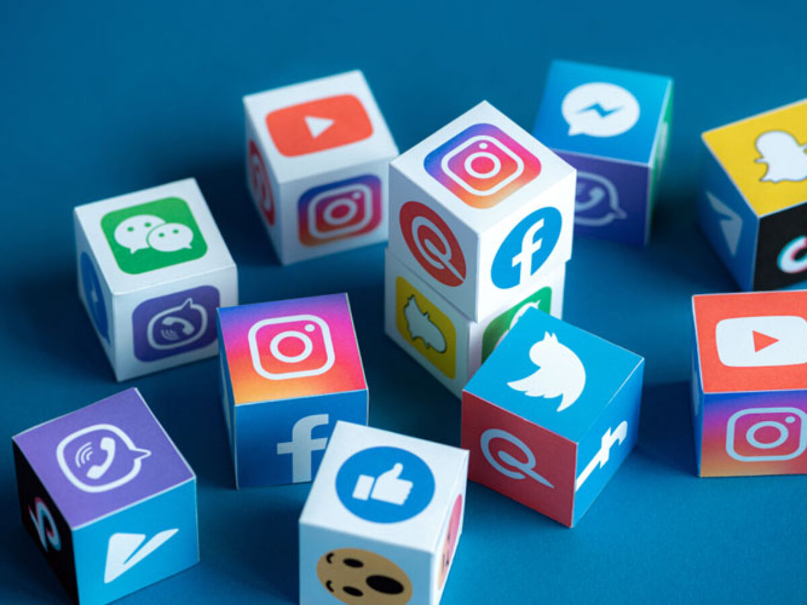

# TEAM

1. Members
* Małgorzata Misztal
* Kinga Cichecka
2. GitHub account names
* MalgorzataMisztal
* KingaCichecka
3. Tasks
* Małgorzata Misztal: task 4, taks 5, task 6
* Kinga Cichecka: task 1, task 2, task 3

# SOCIAL NETWORKING SITES

## Some informations
A social networking service or social networking site, abbreviated as SNS, is a type of online social media platform which people use to build social networks or social relationships with other people who share similar personal or career content, interests, activities, backgrounds or real-life connections.[1][2] Social networking services vary in format and the number of features. They can incorporate a range of new information and communication tools, operating on desktops and on laptops, on mobile devices such as tablet computers and smartphones. This may feature digital photo/video/sharing and diary entries online (blogging).[2] Online community services are sometimes considered social-network services by developers and users, though in a broader sense, a social-network service usually provides an individual-centered service whereas online community services are groups centered. Generally defined as "websites that facilitate the building of a network of contacts in order to exchange various types of content online," social networking sites provide a space for interaction to continue beyond in-person interactions. These computer mediated interactions link members of various networks and may help to create, sustain and develop new social and professional relationships.[3]  
Social networking sites allow users to share ideas, digital photos and videos, posts, and to inform others about online or real-world activities and events with people within their social network. While in-person social networking – such as gathering in a village market to talk about events – has existed since the earliest development of towns,[4] the web enables people to connect with others who live in different locations across the globe (dependent on access to an Internet connection to do so). Depending on the platform, members may be able to contact any other member. In other cases, members can contact anyone they have a connection to, and subsequently anyone that contact has a connection to, and so on.  
Facebook has a massive 2.13 billion active monthly users and an average of 1.4 billion daily active users as of 2017.[5] LinkedIn, a career-oriented social-networking service, generally requires that a member personally know another member in real life before they contact them online. Some services require members to have a preexisting connection to contact other members. With COVID-19, Zoom, a videoconferencing platform, has taken an integral place to connect people located around the world and facilitate many online environments such as school, university, work and government meetings.

## Some  data
| **Social network** | **Active users** | **Market share** | **Launch year** |
| ---- | ---- | ---- | ---- |
| Facebook | 3.070 | 36,64%| 2004 |
| YouTube | 2,530 | 27,01% | 2005 |
| Instagram | 2,000 | 2,47% | 2010 |

## Some images

